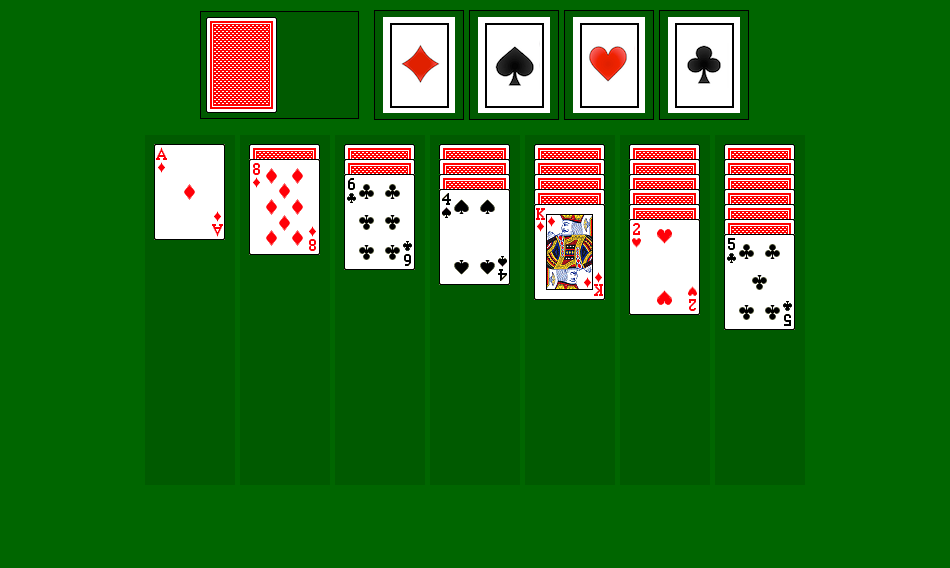

# 🃏 GLI Solitaire

Klondike solitaire with a Swing interface, built on top of a provided game model
(`lib/solitaire.application.jar`). Student project for the GLI course, ISTIC.



## Play it

### On a Mac

Download [**GLI-Solitaire-macOS.zip**](https://github.com/ValentinMumble/gli-solitaire/releases/latest/download/GLI-Solitaire-macOS.zip) from the [latest release](https://github.com/ValentinMumble/gli-solitaire/releases/latest), unzip it, and move **GLI Solitaire.app** to your Applications folder. Java is bundled inside, so there is nothing else to install.

The app is not signed. If macOS blocks it the first time, right-click it in Finder and choose **Open**.

### Anywhere with Java 21

```bash
java -jar dist/GLI-Solitaire.jar
```

## How to play

- Click the deck (top left) to turn over cards.
- Drag cards between the seven columns, alternating colours and going down from King to Ace.
- Drag cards onto the four suit piles (top right), going up from Ace to King, to win.

## Build it

Needs Java 21 and Maven:

```bash
brew install openjdk@21 maven
```

Build the jar:

```bash
export JAVA_HOME=/opt/homebrew/opt/openjdk@21
mvn package
```

Build the Mac app, its zip `target/GLI-Solitaire-macOS.zip`, and refresh `dist/GLI-Solitaire.jar`:

```bash
./build-mac-app.sh
```

To publish a new version, attach the zip and the jar to a new GitHub release:

```bash
gh release create v1.1.0 target/GLI-Solitaire-macOS.zip dist/GLI-Solitaire.jar --title "GLI Solitaire 1.1.0"
```

The game model jar is not on Maven Central, so the build reads it from the `repo/` folder in this project.

## Code layout

The project follows the PAC (Presentation, Abstraction, Control) pattern:

- `solitaire.application` (in `lib/`): the abstraction, the game rules and card piles
- `solitaire.controle`: controls that link the model to the screen
- `solitaire.presentation`: Swing components for cards, columns, the deck and drag and drop
- `solitaire.main.SolitaireGLI`: builds the window and starts a game

`tools/Screenshot.java` opens a game and saves the window as a PNG (this is how `docs/screenshot.png` was made).
